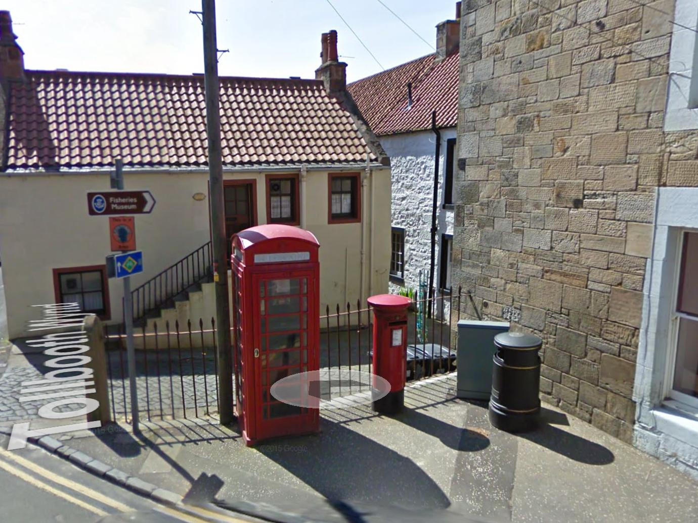

# Internet of Forgotten Things

### Looking at hooking forgotten services into Internet spaces and re-animating forgotten physical resources.

*By Ben Eaton*

Read more at [http://invisibleflock.com/blog/?p=323](http://invisibleflock.com/blog/?p=323)

